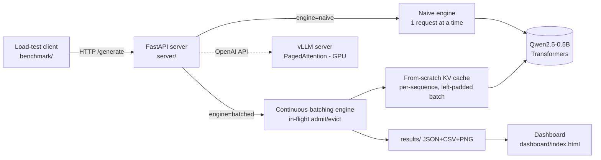
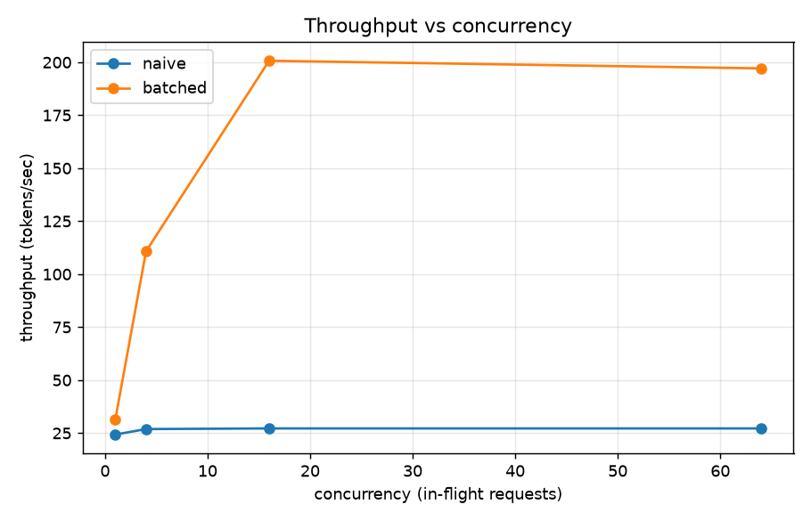

# Distributed LLM Inference & Serving Platform

A self-hosted LLM inference engine built **three ways** — a naive baseline, a **from-scratch engine
with my own KV cache and continuous-batching scheduler**, and a vLLM production baseline — then
benchmarked under load for throughput, latency (p50/p90/p99), and GPU utilization, with an FP16-vs-INT8
quantization study and a GCP/GKE autoscaling deployment.

> The goal isn't to beat vLLM. It's to **build the internals production engines are made of** — KV
> caching, in-flight batching, GPU-utilization reasoning, quantization tradeoffs, autoscaling — and
> measure every claim instead of asserting it.

**Model:** `Qwen/Qwen2.5-0.5B-Instruct` (tiny, ungated) so the *systems* lessons are cheap to iterate;
they're identical at any model size.

---

## Problem

Naive LLM serving processes one request at a time. The GPU — which can decode dozens of sequences in a
single forward pass for nearly the same latency — sits mostly idle, so throughput is low and tail
latency explodes under load. This project builds the optimizations that fix that, from first
principles, and proves each one with a benchmark.

## Architecture



## Engine variants

| Engine | What it is | Why it exists |
|---|---|---|
| **naive** | One request at a time, vanilla `.generate()`, serialized with a lock | The honest control group every optimization is measured against |
| **batched** | My continuous-batching scheduler: one decode step across all in-flight requests, admit/evict at step boundaries, per-sequence KV caches | Demonstrates the core production technique from first principles |
| **vLLM** | Production baseline via its OpenAI server (PagedAttention) | Honest comparison — shows where a paged cache pulls ahead and why |

---

## Headline results (NVIDIA T4 GPU, Qwen2.5-0.5B, 128-token generations)



| engine | c=1 | c=4 | c=16 | c=64 |
|---|---|---|---|---|
| naive — throughput (tok/s) | 24 | 27 | 27 *(flat)* | 27 *(flat)* |
| **batched — throughput (tok/s)** | 31 | 111 | **201** *(scales)* | 197 |
| naive — **p99 latency** | 10s | 11s | 48s | **174s** *(explodes)* |
| batched — **p99 latency** | 4.6s | 4.9s | 7.9s | **19.7s** |

At concurrency 16 the continuous-batching engine delivers **~7.4× the throughput of naive**
(201 vs 27 tok/s) while holding p99 latency **6× lower** (7.9s vs 48s). **Naive throughput is flat
under load** (requests serialize) **with a p99 tail that explodes to 174s at c=64**, while
**batching scales throughput and keeps the tail bounded** — the signature of in-flight batching, and
the gap widens with concurrency. Full interactive table + all four charts:
[`dashboard/index.html`](dashboard/index.html).

> **Honest finding:** batched throughput wins, but its *TTFT rises under burst* because new requests
> are prefilled serially on admission — a real throughput-vs-latency tradeoff that vLLM's chunked
> prefill mitigates. Measuring it (rather than hiding it) is the point.

> **vLLM baseline status:** vLLM is integrated behind the *same* harness via its OpenAI-compatible API
> (`--api openai`), so it benchmarks identically to my engines. The live T4 comparison is pending a
> re-run — the free Colab image shipped a vLLM build with a CUDA-runtime packaging mismatch
> (`libcudart.so.13`), now fixed in [the notebook](notebooks/phase5_gpu_colab.ipynb). Expectation to
> validate: vLLM's PagedAttention should lead at high concurrency by avoiding the left-padding/KV
> fragmentation my contiguous cache pays for.

---

## Deployment & autoscaling (GKE)

Containerized (Cloud Build → Artifact Registry) and deployed to **Google Kubernetes Engine** behind a
LoadBalancer, with a Horizontal Pod Autoscaler. Driving sustained load produced a clean two-layer
autoscale — **HPA scaled pods 1→4** when CPU crossed 60% of request, and the **cluster autoscaler
added a second node** to fit them, capping at `maxReplicas`:

```
00:20  cpu=0%/60%    replicas=1  pods=1  nodes=1   <- idle
00:20  cpu=199%/60%  replicas=4  pods=3  nodes=1   <- load hits, HPA jumps to max
00:21  cpu=105%/60%  replicas=4  pods=4  nodes=2   <- cluster autoscaler adds a node
```

Full captured run: [docs/phase-6-autoscaling.md](docs/phase-6-autoscaling.md). Ran on CPU nodes
(GPU quota pending on a new account); the autoscaling mechanism is identical on GPU. Teardown is one
script (`deploy/teardown.sh`) so nothing keeps billing.

## Key findings

1. **Batching beats serialization, and the win grows with load** — ~7.4× throughput at c=16 on a T4
   (201 vs 27 tok/s); the p99 tail (174s vs 20s at c=64) is where naive serving truly falls apart.
2. **The KV cache turns O(n²) decode into O(n)** — my from-scratch toy shows the work ratio growing
   8.5× → 32.5× → 64.5× with sequence length; on the real model the cached decode is ~5× faster with
   byte-identical output.
3. **Memory, not compute, caps batch size** — KV cache = `2·L·B·H_kv·d·S·bytes`; 24 MiB per 2048-token
   sequence here, so concurrency is a memory-budget problem. This is exactly what PagedAttention
   optimizes.
4. **Quantization is a tradeoff, not a free lunch** — on a T4, bitsandbytes cut peak memory from
   **980 MiB (FP16) → 489 MiB (INT4)** but did *not* speed up a 0.5B model (INT8 6.9 tok/s, INT4 17.7
   vs FP16 27.8) — dequant overhead dominates at this size — and INT4 quality collapsed (perplexity
   14.0 → 25.6). The savings show up as memory, not speed, and only pay off on larger models or with
   native INT8/FP8 kernels. Measured with perplexity + FP16-token-agreement, not just speed.

## Key engineering decisions

- **Engine separate from server** — internals (KV cache, scheduler) are unit-testable without HTTP, and
  the server swaps engines behind one API and request schema.
- **Single scheduler thread owns the model** — serializes GPU access (no racing forward passes); request
  threads only enqueue and wait. The shared batched step *is* the throughput win.
- **Contiguous left-padded batched cache** — correct and simple, and it makes the padding/fragmentation
  waste *visible* — which is precisely the problem vLLM's paged cache solves. I built the version it
  improves on, so I can explain the gap.
- **Benchmark rigor** — closed-loop concurrency, client-side latency (captures queueing), p50/p90/p99
  (not just mean), GPU-utilization sampling, results to JSON/CSV + plotted.
- **Two real bugs caught by tests**, both good interview stories: an `lru_cache` key mismatch that
  double-loaded the model, and a thread-safety race (`lru_cache` caches results, not execution) that
  crashed concurrent startup on meta-tensor materialization.

## What I learned

The autoregressive decode loop and why the KV cache is the central serving constraint; static vs
continuous batching and how to schedule in-flight requests; how to merge ragged per-sequence caches
with correct RoPE positions; benchmarking discipline (tail latency, closed-loop load, honest baselines);
quantization quality measurement; and the container → VM → GKE-autoscaling deployment path with strict
cost control.

---

## Run it

**Local (Python):**
```bash
python3 -m venv .venv && source .venv/bin/activate
pip install -r requirements.txt

pytest -q                                            # 20 tests

# Serve (8000 may be taken locally; use 8077)
uvicorn server.app:app --port 8077
curl -X POST localhost:8077/generate -H "Content-Type: application/json" \
  -d '{"prompt":"What is a KV cache?","max_tokens":48,"engine":"batched"}'

# Benchmark both engines + build the dashboard
python benchmark/runner.py --concurrency 1,4,16 --requests 16 --max-tokens 32
python benchmark/plot.py
python dashboard/build_dashboard.py                  # -> dashboard/index.html
```

**Local (Docker, one command):**
```bash
docker compose -f deploy/docker-compose.yml up --build   # -> http://localhost:8077/health
```

**GPU / cloud (vLLM, quantization, GKE):** see the runbooks in [docs/phase-5.md](docs/phase-5.md) and
[docs/phase-6.md](docs/phase-6.md). GPUs bill hourly — each runbook ends with a teardown checklist.

## Demos worth watching
```bash
python scripts/kv_cache_demo.py      # O(n^2)->O(n) work ratio + ~5x real-model speedup + memory table
python scripts/batching_demo.py      # batched vs naive throughput across concurrency
```

---

## Repository layout

| Directory | Purpose |
|---|---|
| `engine/` | Inference internals: model loader, from-scratch KV cache, manual decode, continuous-batching scheduler, quantization loaders |
| `server/` | FastAPI serving layer (`naive` / `batched` engine selector) |
| `benchmark/` | Async load tester, stats, GPU sampler, sweep runner, plots, quantization comparison |
| `deploy/` | Dockerfiles, docker-compose, GKE manifests (deployment/service/HPA) |
| `dashboard/` | Self-contained benchmark dashboard generator |
| `docs/` | Per-phase write-ups + **PDF interview-prep** (`docs/pdf/`) |
| `tests/` | pytest suite (20 tests) |
| `scripts/` | Demos + the markdown→PDF tool |

## Build phases & write-ups

Each phase has a markdown write-up and a PDF (what was built, why, and interview Q&A) in `docs/`:

0. [Scaffold + local model load](docs/phase-0.md) ✅
1. [Naive baseline server](docs/phase-1.md) ✅
2. [From-scratch KV cache](docs/phase-2.md) ✅
3. [Continuous batching scheduler](docs/phase-3.md) ✅
4. [Benchmark harness & load testing](docs/phase-4.md) ✅
5. [vLLM baseline + quantization](docs/phase-5.md) 🟡 *(code ready; run on GPU via [Colab notebook](notebooks/phase5_gpu_colab.ipynb) — GCP GPU quota pending)*
6. [Containerize & deploy on GCP/GKE](docs/phase-6.md) ✅ — **deployed on GKE; [live autoscaling demo](docs/phase-6-autoscaling.md) (HPA 1→4 + node autoscale)**
7. Dashboard & this README ✅
